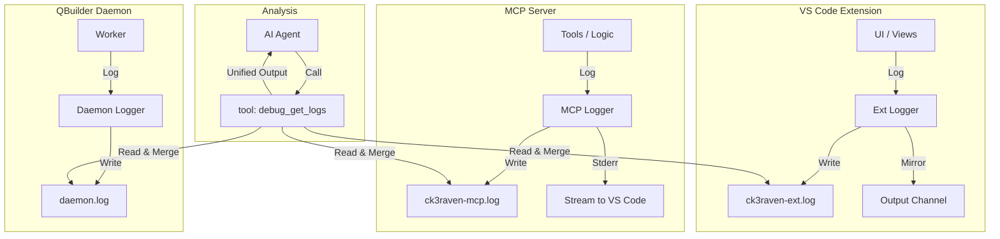

# Canonical Logging Architecture

> **Status:** CANONICAL  
> **Last Updated:** January 31, 2026  
> **Purpose:** Unified logging for ck3raven infrastructure (excluding QBuilder)

---

## Canonical Invariants (MANDATORY)

These invariants are **non-negotiable** and must be followed by all implementations:

| # | Invariant | Rationale |
|---|-----------|-----------|
| 1 | **Separate log files per runtime** | Windows file locking prevents shared files between Python and Node.js |
| 2 | **ISO 8601 UTC timestamps everywhere** | `YYYY-MM-DDTHH:MM:SS.mmmZ` enables chronological merging across processes |
| 3 | **Instance ID in every log entry** | Multi-window isolation requires knowing which instance produced each log |
| 4 | **Trace ID correlation mandatory** | UI action → MCP tool → result must be linkable for debugging |
| 5 | **Fail-safe logging behavior** | Logging failures MUST NEVER crash the application |
| 6 | **trace.log and debug logs are complementary** | Audit trail (trace.log) and diagnostics (ck3raven-*.log) serve different purposes |

---

## Problem Statement

Current logging is fragmented:

| Component | Current Approach | Problems |
|-----------|-----------------|----------|
| MCP Server | `trace.log()` to JSONL | No structured categories, no levels |
| VS Code Extension | `Logger` class to Output Channel | Not persisted, lost on reload |
| Contract System | Inline `trace.log()` calls | Mixed with other trace events |
| Session/Mode | No logging | Invisible state changes |

**Key Issues:**
1. **No unified log file** for debugging cross-component issues
2. **Extension logs lost on reload** - can't debug deactivate() behavior
3. **No log levels** - can't filter DEBUG vs INFO vs ERROR
4. **No categories** - can't isolate MCP vs Extension vs Contract events
5. **QBuilder has its own logging** (correct) but other components don't

---

## Scope

### IN SCOPE (This Specification)
- MCP Server (`tools/ck3lens_mcp/`)
- VS Code Extension (`tools/ck3lens-explorer/`)
- Contract System
- Session/Mode management
- Policy enforcement

### OUT OF SCOPE (Separate System)
- QBuilder daemon (`builder/`) - has its own `daemon.log`
- Database operations - use QBuilder logging
- Parser internals - use Python logging

---

## Architecture Overview

### Critical Design Decision: Separate Log Files

**⚠️ CRITICAL: MCP Server and VS Code Extension MUST NOT share a log file.**

On Windows, files are locked exclusively during writes. If both Python (MCP) and
Node.js (Extension) write to the same file, one will crash or hang when they
attempt simultaneous writes.

**Solution:** Each runtime owns its own log file. Aggregation happens at read-time
via a dedicated tool, not at the filesystem level.



---

## Log File Location

```
~/.ck3raven/logs/
├── ck3raven-mcp.log      # MCP Server (Python) - current day
├── ck3raven-mcp.log.1    # Previous day (rotated)
├── ck3raven-ext.log      # VS Code Extension (Node) - current day
├── ck3raven-ext.log.1    # Previous day (rotated)
└── daemon.log            # QBuilder (existing, unchanged) - symlink or copy
```

**Note:** `daemon.log` lives at `~/.ck3raven/daemon/daemon.log` - the aggregator
tool reads it from there.

---

## Log Format

**JSONL format** (one JSON object per line):

```json
{"ts": "2026-01-25T14:32:01.234Z", "level": "INFO", "cat": "mcp.init", "inst": "kiak", "trace_id": "a1b2c3d4", "msg": "Mode initialized", "data": {"mode": "ck3raven-dev"}}
{"ts": "2026-01-25T14:32:01.456Z", "level": "DEBUG", "cat": "contract", "inst": "kiak", "trace_id": "a1b2c3d4", "msg": "Contract opened", "data": {"contract_id": "c-abc123"}}
{"ts": "2026-01-25T14:32:02.789Z", "level": "ERROR", "cat": "mcp.tool", "inst": "kiak", "trace_id": "a1b2c3d4", "msg": "Tool failed", "data": {"tool": "ck3_file", "error": "Path not found"}}
```

**Fields:**
| Field | Type | Description |
|-------|------|-------------|
| `ts` | ISO8601 UTC | **MANDATORY:** `YYYY-MM-DDTHH:MM:SS.mmmZ` (UTC, milliseconds) |
| `level` | string | DEBUG, INFO, WARN, ERROR |
| `cat` | string | Category (dot-separated hierarchy) |
| `inst` | string | Instance ID (for multi-window isolation) |
| `trace_id` | string | Correlation ID linking UI action → MCP → QBuilder |
| `msg` | string | Human-readable message |
| `data` | object | Structured context (optional) |

---

## Timestamp Standardization (CRITICAL)

**All components MUST use ISO 8601 UTC format:**

```
YYYY-MM-DDTHH:MM:SS.mmmZ
```

Example: `2026-01-25T14:32:01.234Z`

**Why:**
- Enables chronological interleaving across logs from different processes
- Eliminates timezone confusion
- QBuilder `daemon.log` must also adopt this format

---

## Trace ID Correlation

**Problem:** When a user clicks "Lint File" and it fails, you see an error in
`ck3raven-ext.log` and a stack trace in `ck3raven-mcp.log`, but nothing links them.

**Solution:** Generate a `trace_id` at the UI entry point and pass it through
all downstream operations.

```typescript
// Extension: Generate trace_id at action start
const traceId = crypto.randomUUID().slice(0, 8);
logger.info('ext.lint', 'Lint requested', { file, traceId });

// Pass to MCP tool
const result = await mcpCall('ck3_validate', { ..., _trace_id: traceId });
```

```python
# MCP: Extract trace_id from params and include in logs
trace_id = params.get("_trace_id", "no-trace")
info("mcp.tool", "Validating file", trace_id=trace_id, file=file)
```

---

## Log Levels

| Level | When to Use |
|-------|-------------|
| `DEBUG` | Detailed diagnostic info, function entry/exit, state dumps |
| `INFO` | Normal operations: mode changes, tool calls, contract lifecycle |
| `WARN` | Recoverable issues: fallback behavior, deprecated usage |
| `ERROR` | Failures: tool errors, policy denials, exceptions |

**Default Level:** `INFO` (configurable via environment variable)

---

## Categories

Hierarchical dot-separated categories:

```
mcp.init          # MCP server initialization
mcp.tool          # Tool invocations
mcp.dispose       # Server shutdown/disposal
mcp.bootstrap     # Pre-logger initialization phase

ext.activate      # Extension activation
ext.deactivate    # Extension deactivation
ext.mcp           # MCP registration/disposal
ext.bootstrap     # Pre-logger initialization phase

contract.open     # Contract opened
contract.close    # Contract closed
contract.cancel   # Contract cancelled

session.mode      # Mode changes
session.playset   # Playset changes

policy.enforce    # Policy enforcement decisions
policy.token      # Token requests/validation
```

---

## Key Logging Points

### MCP Server (MANDATORY)

| Event | Category | Level | Data |
|-------|----------|-------|------|
| Server starting | `mcp.init` | INFO | `{instance_id}` |
| Mode set | `session.mode` | INFO | `{mode, previous}` |
| Tool called | `mcp.tool` | DEBUG | `{tool, params, trace_id}` |
| Tool succeeded | `mcp.tool` | DEBUG | `{tool, result_size}` |
| Tool failed | `mcp.tool` | ERROR | `{tool, error, trace_id}` |
| EOF received | `mcp.dispose` | INFO | `{reason: "EOF on stdin"}` |
| Server disposing | `mcp.dispose` | INFO | `{instance_id}` |

### Extension (MANDATORY)

| Event | Category | Level | Data |
|-------|----------|-------|------|
| Activate start | `ext.activate` | INFO | `{version}` |
| MCP registration | `ext.mcp` | INFO | `{instance_id}` |
| MCP registration failed | `ext.mcp` | ERROR | `{error}` |
| Deactivate start | `ext.deactivate` | INFO | - |
| MCP disposal | `ext.mcp` | DEBUG | `{instance_id}` |
| Deactivate complete | `ext.deactivate` | INFO | - |

### Contracts (MANDATORY)

| Event | Category | Level | Data |
|-------|----------|-------|------|
| Contract opened | `contract.open` | INFO | `{contract_id, intent, trace_id}` |
| Contract closed | `contract.close` | INFO | `{contract_id, commit}` |
| Contract cancelled | `contract.cancel` | INFO | `{contract_id, reason}` |

---

## Fail-Safe Behavior (MANDATORY)

**Logging failures MUST NOT crash the application.**

| Failure | Behavior |
|---------|----------|
| Log directory doesn't exist | Create it; if that fails, use stderr |
| Log file write fails | Fall back to stderr/console |
| stderr write fails | Silently drop (last resort) |
| Rotation fails | Skip rotation, continue logging |
| Sanitization fails | Log without data field |

---

## Implementation Files

| Component | File | Purpose |
|-----------|------|---------|
| Python Logger | `tools/ck3lens_mcp/ck3lens/logging.py` | Structured logging with JSONL output |
| Python Rotation | `tools/ck3lens_mcp/ck3lens/log_rotation.py` | Daily rotation with 7-day retention |
| TypeScript Logger | `tools/ck3lens-explorer/src/utils/structuredLogger.ts` | Extension logging with file persistence |
| Aggregator Tool | `debug_get_logs` in server.py | Cross-component log merging |

---

## Python Implementation

```python
# tools/ck3lens_mcp/ck3lens/logging.py

import json
import os
import sys
from datetime import datetime, timezone
from pathlib import Path
from typing import Any

_LOG_DIR = Path.home() / ".ck3raven" / "logs"
_LOG_FILE = _LOG_DIR / "ck3raven-mcp.log"
_INSTANCE_ID = os.environ.get("CK3LENS_INSTANCE_ID", "default")
_LOG_LEVEL = os.environ.get("CK3LENS_LOG_LEVEL", "INFO").upper()

_LEVEL_ORDER = {"DEBUG": 0, "INFO": 1, "WARN": 2, "ERROR": 3}
_initialized = False

# Thread-local trace_id context
import threading
_trace_context = threading.local()

def set_trace_id(trace_id: str):
    """Set trace ID for current operation context."""
    _trace_context.trace_id = trace_id

def get_trace_id() -> str:
    """Get current trace ID or 'no-trace'."""
    return getattr(_trace_context, 'trace_id', 'no-trace')

def _ensure_log_dir():
    global _initialized
    if not _initialized:
        try:
            _LOG_DIR.mkdir(parents=True, exist_ok=True)
            _initialized = True
        except Exception:
            pass  # Fail silently - will use stderr fallback

def _should_log(level: str) -> bool:
    return _LEVEL_ORDER.get(level, 1) >= _LEVEL_ORDER.get(_LOG_LEVEL, 1)

def _sanitize(data: dict) -> dict:
    """Remove or mask sensitive data."""
    if not data:
        return data
    sanitized = {}
    for k, v in data.items():
        # Mask API keys
        if 'key' in k.lower() or 'token' in k.lower() or 'secret' in k.lower():
            sanitized[k] = "***REDACTED***"
        # Truncate large values
        elif isinstance(v, str) and len(v) > 1000:
            sanitized[k] = v[:1000] + "...[truncated]"
        else:
            sanitized[k] = v
    return sanitized

def log(level: str, category: str, msg: str, data: dict[str, Any] | None = None, trace_id: str | None = None):
    """Write structured log entry with fail-safe behavior."""
    if not _should_log(level):
        return
    
    _ensure_log_dir()
    
    entry = {
        "ts": datetime.now(timezone.utc).strftime("%Y-%m-%dT%H:%M:%S.") + 
              f"{datetime.now(timezone.utc).microsecond // 1000:03d}Z",
        "level": level,
        "cat": category,
        "inst": _INSTANCE_ID,
        "trace_id": trace_id or get_trace_id(),
        "msg": msg,
    }
    if data:
        entry["data"] = _sanitize(data)
    
    line = json.dumps(entry) + "\n"
    
    # Fail-safe: try file, fall back to stderr
    try:
        with open(_LOG_FILE, "a", encoding="utf-8") as f:
            f.write(line)
    except Exception:
        # Graceful degradation - don't crash the app
        try:
            sys.stderr.write(f"[LOG FALLBACK] {line}")
        except Exception:
            pass  # Last resort: silently drop

def debug(category: str, msg: str, **data): log("DEBUG", category, msg, data or None)
def info(category: str, msg: str, **data): log("INFO", category, msg, data or None)
def warn(category: str, msg: str, **data): log("WARN", category, msg, data or None)
def error(category: str, msg: str, **data): log("ERROR", category, msg, data or None)

# Bootstrap logging - before logger is fully initialized
def bootstrap(msg: str):
    """Log during bootstrap phase (before full init). Always writes to stderr."""
    ts = datetime.now(timezone.utc).strftime("%Y-%m-%dT%H:%M:%S.%f")[:-3] + "Z"
    sys.stderr.write(f"[BOOTSTRAP {ts}] {msg}\n")
```

---

## TypeScript Implementation

```typescript
// tools/ck3lens-explorer/src/utils/structuredLogger.ts

import * as fs from 'fs';
import * as path from 'path';
import * as os from 'os';
import * as vscode from 'vscode';

const LOG_DIR = path.join(os.homedir(), '.ck3raven', 'logs');
const LOG_FILE = path.join(LOG_DIR, 'ck3raven-ext.log');
const MAX_BUFFER_SIZE = 50;  // Flush after 50 entries
const FLUSH_INTERVAL_MS = 1000;  // Or every 1 second

type LogLevel = 'DEBUG' | 'INFO' | 'WARN' | 'ERROR';

interface LogEntry {
    ts: string;
    level: LogLevel;
    cat: string;
    inst: string;
    trace_id: string;
    msg: string;
    data?: Record<string, unknown>;
}

const LEVEL_ORDER: Record<LogLevel, number> = {
    DEBUG: 0, INFO: 1, WARN: 2, ERROR: 3
};

export class StructuredLogger {
    private instanceId: string;
    private outputChannel: vscode.OutputChannel | null;
    private buffer: string[] = [];
    private flushTimer: NodeJS.Timeout | null = null;
    private logLevel: LogLevel = 'INFO';
    private currentTraceId: string = 'no-trace';
    
    constructor(instanceId: string, outputChannel?: vscode.OutputChannel) {
        this.instanceId = instanceId;
        this.outputChannel = outputChannel || null;
        
        try {
            fs.mkdirSync(LOG_DIR, { recursive: true });
        } catch {
            // Will use console fallback
        }
        
        // Start flush timer
        this.flushTimer = setInterval(() => this.flush(), FLUSH_INTERVAL_MS);
    }
    
    setTraceId(traceId: string): void {
        this.currentTraceId = traceId;
    }
    
    generateTraceId(): string {
        const id = Math.random().toString(36).substring(2, 10);
        this.currentTraceId = id;
        return id;
    }
    
    private shouldLog(level: LogLevel): boolean {
        return LEVEL_ORDER[level] >= LEVEL_ORDER[this.logLevel];
    }
    
    private sanitize(data?: Record<string, unknown>): Record<string, unknown> | undefined {
        if (!data) return undefined;
        const sanitized: Record<string, unknown> = {};
        for (const [k, v] of Object.entries(data)) {
            if (k.toLowerCase().includes('key') || 
                k.toLowerCase().includes('token') || 
                k.toLowerCase().includes('secret')) {
                sanitized[k] = '***REDACTED***';
            } else if (typeof v === 'string' && v.length > 1000) {
                sanitized[k] = v.substring(0, 1000) + '...[truncated]';
            } else {
                sanitized[k] = v;
            }
        }
        return sanitized;
    }
    
    private write(entry: LogEntry): void {
        const line = JSON.stringify(entry);
        
        // Add to buffer
        this.buffer.push(line);
        
        // Mirror to output channel
        if (this.outputChannel) {
            this.outputChannel.appendLine(`[${entry.level}] ${entry.cat}: ${entry.msg}`);
        }
        
        // Flush if buffer is full
        if (this.buffer.length >= MAX_BUFFER_SIZE) {
            this.flush();
        }
    }
    
    flush(): void {
        if (this.buffer.length === 0) return;
        
        const lines = this.buffer.join('\n') + '\n';
        this.buffer = [];
        
        try {
            fs.appendFileSync(LOG_FILE, lines);
        } catch {
            // Graceful degradation
            console.error('[LOG FALLBACK]', lines);
        }
    }
    
    log(level: LogLevel, category: string, msg: string, data?: Record<string, unknown>): void {
        if (!this.shouldLog(level)) return;
        
        this.write({
            ts: new Date().toISOString(),
            level,
            cat: category,
            inst: this.instanceId,
            trace_id: this.currentTraceId,
            msg,
            ...(data && { data: this.sanitize(data) })
        });
    }
    
    debug(cat: string, msg: string, data?: Record<string, unknown>) { this.log('DEBUG', cat, msg, data); }
    info(cat: string, msg: string, data?: Record<string, unknown>) { this.log('INFO', cat, msg, data); }
    warn(cat: string, msg: string, data?: Record<string, unknown>) { this.log('WARN', cat, msg, data); }
    error(cat: string, msg: string, data?: Record<string, unknown>) { this.log('ERROR', cat, msg, data); }
    
    // Bootstrap logging - before full init
    bootstrap(msg: string): void {
        const ts = new Date().toISOString();
        console.log(`[BOOTSTRAP ${ts}] ${msg}`);
    }
    
    dispose(): void {
        if (this.flushTimer) {
            clearInterval(this.flushTimer);
            this.flushTimer = null;
        }
        this.flush();
    }
}
```

---

## Log Rotation

**Daily rotation with 7-day retention:**

```python
# tools/ck3lens_mcp/ck3lens/log_rotation.py

from datetime import datetime, timezone
from pathlib import Path

_LOG_DIR = Path.home() / ".ck3raven" / "logs"
_LOG_FILE = _LOG_DIR / "ck3raven-mcp.log"

def rotate_logs():
    """Rotate logs if current log is from a previous day."""
    if not _LOG_FILE.exists():
        return
    
    try:
        log_mtime = datetime.fromtimestamp(_LOG_FILE.stat().st_mtime, tz=timezone.utc)
        if log_mtime.date() < datetime.now(timezone.utc).date():
            # Rotate existing logs
            for i in range(6, 0, -1):
                old = _LOG_DIR / f"ck3raven-mcp.log.{i}"
                new = _LOG_DIR / f"ck3raven-mcp.log.{i+1}"
                if old.exists():
                    if i == 6:
                        old.unlink()  # Delete oldest
                    else:
                        old.rename(new)
            
            _LOG_FILE.rename(_LOG_DIR / "ck3raven-mcp.log.1")
    except Exception:
        pass  # Don't fail startup due to rotation issues
```

---

## Log Aggregator Tool

**MCP Tool: `debug_get_logs`**

This tool reads all log files, parses timestamps, and returns a chronologically
interleaved view. This tool exists specifically so users can copy-paste the
agent's output back to external review.

```python
@mcp.tool()
def debug_get_logs(
    lines: int = 50,
    level: Literal["DEBUG", "INFO", "WARN", "ERROR"] | None = None,
    category: str | None = None,
    trace_id: str | None = None,
    source: Literal["all", "mcp", "ext", "daemon"] = "all",
) -> dict:
    """
    Get recent logs from all ck3raven components, merged chronologically.
    
    Args:
        lines: Maximum total lines to return (default 50)
        level: Filter by minimum level
        category: Filter by category prefix
        trace_id: Filter by trace ID (for debugging specific operations)
        source: Which log sources to include
    
    Returns:
        Merged, chronologically sorted log entries
    """
    log_files = {
        "mcp": Path.home() / ".ck3raven" / "logs" / "ck3raven-mcp.log",
        "ext": Path.home() / ".ck3raven" / "logs" / "ck3raven-ext.log",
        "daemon": Path.home() / ".ck3raven" / "daemon" / "daemon.log",
    }
    
    entries = []
    for src, path in log_files.items():
        if source != "all" and source != src:
            continue
        if not path.exists():
            continue
        
        try:
            with open(path, "r", encoding="utf-8") as f:
                for line in f:
                    try:
                        entry = json.loads(line.strip())
                        entry["_source"] = src
                        
                        # Apply filters
                        if level and LEVEL_ORDER.get(entry.get("level", "INFO"), 1) < LEVEL_ORDER.get(level, 1):
                            continue
                        if category and not entry.get("cat", "").startswith(category):
                            continue
                        if trace_id and entry.get("trace_id") != trace_id:
                            continue
                        
                        entries.append(entry)
                    except json.JSONDecodeError:
                        continue
        except Exception:
            continue
    
    # Sort by timestamp
    entries.sort(key=lambda e: e.get("ts", ""))
    
    # Return most recent
    return {
        "entries": entries[-lines:],
        "total_available": len(entries),
        "truncated": len(entries) > lines,
    }
```

---

## Performance Considerations

1. **Default level: INFO** - DEBUG logging can be expensive in tight loops
2. **Buffered writes (Extension)** - Batch writes to reduce syscalls
3. **Async file IO not required** - JSONL appends are fast enough
4. **Avoid logging in hot paths** - Parser internals should not log per-token

---

## Relationship to Existing Systems

| System | Purpose | Log Location |
|--------|---------|--------------|
| `trace.log` (JSONL) | MCP tool audit trail | `~/.ck3raven/ck3lens_trace.jsonl` |
| `daemon.log` | QBuilder operations | `~/.ck3raven/daemon/daemon.log` |
| **ck3raven-mcp.log** | MCP server debugging | `~/.ck3raven/logs/ck3raven-mcp.log` |
| **ck3raven-ext.log** | Extension debugging | `~/.ck3raven/logs/ck3raven-ext.log` |

**Trace vs Log:**
- `trace.log` = Audit trail (what tools were called, for policy validation)
- `ck3raven-*.log` = Debugging (detailed state changes, errors, diagnostics)

Both are complementary, not replacements.

---

## Configuration

**Environment Variables:**

| Variable | Default | Description |
|----------|---------|-------------|
| `CK3LENS_LOG_LEVEL` | `INFO` | Minimum level to log |
| `CK3LENS_INSTANCE_ID` | `default` | Instance identifier |

**Future:** VS Code setting `ck3lens.logLevel` could override for extension.

---

## Validation Criteria

After logging is implemented, these must be verifiable from logs alone:

| Criterion | How to Verify |
|-----------|---------------|
| MCP server started | `cat` = `mcp.init`, `level` = `INFO` |
| Mode was initialized | `cat` = `session.mode`, contains `mode` in data |
| Extension activated | `cat` = `ext.activate` |
| Window closed cleanly | `cat` = `mcp.dispose` with EOF reason |
| Tool failure traced | `cat` = `mcp.tool`, `level` = `ERROR`, trace_id present |

---

## Changelog

| Date | Changes |
|------|---------|
| 2026-01-31 | Promoted to CANONICAL status. Added Canonical Invariants section. Added Validation Criteria section. |
| 2026-01-26 | Consulting AI Review incorporated. Separated log files per runtime. Added trace ID correlation. |
| 2026-01-25 | Initial proposal created. |
